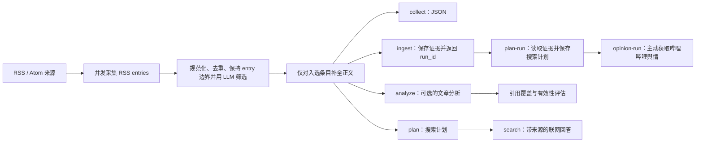

<div align="center">

# Information Agent

从 RSS/Atom 到可追溯结论的证据优先信息工作流

[](https://github.com/Ita-Hloks/InformationAgent/actions/workflows/ci.yml)
[](https://github.com/Ita-Hloks/InformationAgent/stargazers)

</div>

## 这是什么？

Information Agent 是一个 Python CLI：它从一个或多个 RSS/Atom 来源并发采集内容，将每个 RSS entry 按一篇文章保存为独立候选，再交给 LLM 按研究主题做语义筛选，生成结构化 JSON、SQLite 文章快照、可持久化搜索计划或带来源的联网回答。

项目把确定性边界与语义判断分开：RSS entry 边界、HTML 清洗、去重、候选 ID 校验、数量上限、重试和状态由普通代码完成；LLM 只负责判断整条 entry 是否直接相关，不拆分、合并或改写文章。没有证据时，工作流不会生成事实结论；单个来源或语义筛选失败时，已取得的快照和错误上下文仍会保留，但未经判定的文章不会放行。

## 快速开始

需要 Python 3.11 或更高版本。

```bash
git clone https://github.com/Ita-Hloks/InformationAgent.git
cd InformationAgent
python -m venv .venv
```

激活虚拟环境：

```powershell
# Windows PowerShell
.venv\Scripts\Activate.ps1
```

```bash
# macOS / Linux
source .venv/bin/activate
```

安装依赖并配置 `LLM_API_KEY` 后运行采集流程：

```bash
python -m pip install -r requirements.txt
python -m information_agent.cli collect "人工智能" "https://www.geekpark.net/rss" --limit 5
```

命令默认将 UTF-8 JSON 输出到标准输出。所有子命令都可使用 `--output PATH`，让 Python 直接将结果写入 UTF-8 文件并覆盖同名文件；目标文件的父目录必须已经存在。可同时传入多个 RSS/Atom 地址；`--timeout` 控制整条工作流的总时限，`--limit` 控制输出或送入后续阶段的文章数。

Windows PowerShell 5.1 处理原生进程管道时可能错误解码 UTF-8，建议直接写入文件后读取：

```powershell
python -m information_agent.cli ingest `
  "人工智能" `
  "https://www.geekpark.net/rss" `
  --limit 5 `
  --output ingest-result.json

$result = Get-Content ingest-result.json -Raw -Encoding UTF8 | ConvertFrom-Json
$result.run_id
```

## 工作流



| 命令 | 用途 | 额外配置 |
| --- | --- | --- |
| `collect` | 采集、规范化、LLM 语义筛选并输出 JSON | `LLM_*` |
| `ingest` | 保存运行记录、全部规范化文章快照、筛选关系与 Feed 缓存 | `LLM_*` |
| `analyze` | 基于已筛选证据生成带证据编号的分析，并评估引用 | `LLM_*` |
| `plan` | 从最多 5 篇候选文章中生成可追溯的搜索计划 | `LLM_*` |
| `plan-run` | 根据 `ingest` 的 `run_id` 读取已选证据，并将规划运行、原始响应、计划与查询写回 SQLite | `LLM_*` |
| `opinion-run` | 对阅读器中的文章主动获取哔哩哔哩评论并分析争议点 | `LLM_*`，可选 `BILIBILI_COOKIE` |
| `opinion-status` | 只读取文章最近一次舆情分析状态，不触发采集或 LLM | 无 |
| `list-runs` | 离线只读地列出最近保存的研究运行及其聚合计数 | 无 |
| `search` | 执行采集、规划和联网回答，保留搜索来源 | `LLM_*` 与 `SEARCH_LLM_*` |
| `verify-search` | 用固定问题检查联网搜索配置、请求和来源返回 | `SEARCH_LLM_*` |

查看全部参数：

```bash
python -m information_agent.cli --help
python -m information_agent.cli collect --help
python -m information_agent.cli plan-run --help
python -m information_agent.cli opinion-run --help
python -m information_agent.cli opinion-status --help
python -m information_agent.cli list-runs --help
```

保存经过语义筛选的采集结果：

```bash
python -m information_agent.cli ingest \
  "人工智能" \
  "https://www.geekpark.net/rss" \
  --limit 10
```

数据库默认写入 `data/information_agent.db`，命令输出的 JSON 包含用于追踪本次入库的 `run_id`。如需修改数据库位置，请在当前 Shell 中设置 `INFORMATION_AGENT_DB_PATH`。

Use `list-runs` to inspect recent persisted runs without loading credentials or changing the database. It returns at most 20 runs by default; `--limit` accepts 1 through 100, and `--status` accepts `collecting`, `completed`, `partial`, or `failed`.

```bash
python -m information_agent.cli list-runs --limit 20 --status completed
```

要基于这次入库的已选证据生成并保存搜索计划，把输出中的 `run_id` 传给 `plan-run`：

```text
python -m information_agent.cli plan-run RUN_ID --timeout 60
```

命令会返回同一个 `run_id` 和本次规划的 `planning_run_id`。规划结果、查询、原始模型响应以及失败状态都会写回同一 SQLite 数据库。

舆情分析是独立的主动操作。先从文章列表或数据库获取 `article_id`，再执行：

```text
python -m information_agent.cli opinion-run ARTICLE_ID --timeout 120 --limit 100
python -m information_agent.cli opinion-status ARTICLE_ID
```

首版只接受文章本身是哔哩哔哩视频或专栏的 URL。`opinion-status` 是只读查询；重复的 `opinion-run` 默认复用最近一次已完成或部分完成的结果，使用 `--refresh` 才会重新采集。评论样本只保存到当前分析运行，登录 Cookie 不写入数据库。

舆情结果只描述最近 72 小时内获取到的哔哩哔哩公开评论样本，不代表总体民意或全体观众意见，也不用于证明文章主张为真。`collected_count` 是当前运行保存的评论数，`analyzed_count` 是送入分类阶段的评论数，`classification_total`、`classified_count` 和 `unclassified_count` 来自逐条“争议点-评论”关系；`points.stance_counts` 由这些合法关系重新计算。

状态原因用于区分流程边界：没有争议点为 `completed/no_controversy_points`，评论接口正常但样本为空为 `completed/sample_empty`，保留评论但分类有缺口为 `partial/partial_classification`，没有可用分析结果的关键失败为 `failed`。`not_requested` 只表示当前文章尚未创建运行。

## 配置 LLM 与联网搜索

复制环境变量示例：

```powershell
# Windows PowerShell
Copy-Item .env.example .env
```

```bash
# macOS / Linux
cp .env.example .env
```

按使用的命令填写以下变量：

| 变量 | 用途 | 默认值 |
| --- | --- | --- |
| `LLM_API_KEY` | `collect`、`ingest`、`analyze`、`plan`、`plan-run`、`opinion-run` 和 `search` 的模型凭据 | 必填 |
| `LLM_BASE_URL` | OpenAI 兼容 API 根地址 | `https://api.openai.com/v1` |
| `LLM_MODEL` | 语义筛选、分析与规划模型 | `gpt-4o-mini` |
| `SEARCH_LLM_API_KEY` | 联网搜索服务凭据 | 必填 |
| `SEARCH_LLM_MODEL` | 支持项目所需 `web_search` 工具的模型 | 必填 |
| `SEARCH_LLM_BASE_URL` | 联网搜索服务的 OpenAI 兼容 API 根地址 | 必填 |
| `SEARCH_LLM_RESULT_COUNT` | 每次搜索返回的结果数量，范围 1–50 | `5` |
| `SEARCH_LLM_CONTENT_SIZE` | 搜索内容大小：`low`、`medium` 或 `high` | `medium` |
| `SEARCH_LLM_TIMEOUT_SECONDS` | 单次联网回答的最长时限 | `60` |

配置完成后，可先验证搜索服务：

```bash
python -m information_agent.cli verify-search
```

再运行分析、规划或完整搜索：

```bash
python -m information_agent.cli analyze "人工智能" "https://www.geekpark.net/rss"
python -m information_agent.cli plan "人工智能" "https://www.geekpark.net/rss"
python -m information_agent.cli search "人工智能" "https://www.geekpark.net/rss"
```

## 本地文章订阅 API

当前已提供一个面向本地阅读器的最小 HTTP API。RSS/Atom 订阅、刷新、文章读取和阅读状态不调用 LLM；舆情接口只有在显式 POST 时才调用模型和哔哩哔哩评论接口。当前没有登录系统，多用户隔离和跨设备同步仍未实现。

安装依赖后，在项目根目录启动服务：

```powershell
python -m uvicorn information_agent.api:app --host 127.0.0.1 --port 8001
```

主要接口：

| 方法 | 路径 | 用途 |
| --- | --- | --- |
| `GET` | `/api/health` | 健康检查 |
| `GET` | `/api/feeds` | 获取已订阅来源 |
| `POST` | `/api/feeds` | 添加来源，JSON 为 `{ "url": "https://...", "title": "可选名称" }`；添加时会立即抓取一次 |
| `POST` | `/api/feeds/{feed_id}/refresh` | 刷新一个来源 |
| `GET` | `/api/articles?feed_id=...&limit=100&offset=0` | 获取文章列表 |
| `GET` | `/api/articles/{article_id}` | 获取文章详情 |
| `GET` | `/api/articles/{article_id}/opinion` | 读取最近一次舆情分析状态，不触发分析 |
| `POST` | `/api/articles/{article_id}/opinion` | 主动触发一次舆情分析；可选 JSON `{ "force_refresh": true }` |
| `PUT` | `/api/articles/state` | 批量更新文章已读/收藏状态，JSON 为 `{ "article_ids": ["..."], "is_read": true, "is_saved": false }` |

重要前置条件与约束：

- 第一版要求用户提供明确的 RSS/Atom `http` 或 `https` 地址，不自动从网站首页发现 Feed；没有 LLM API Key 也可以使用订阅和读取接口。
- 服务默认仅监听 `127.0.0.1`，没有用户认证、权限隔离、跨设备同步和公网部署安全保障；若改变监听地址，必须先补认证、CORS、CSRF/访问控制和 SSRF 防护评审。
- 单次 Feed 响应上限为 5 MiB，网页正文抓取仍是独立流程；RSS 摘要不足 20 个字符的条目不会进入文章列表。上游的 403、429、超时或解析失败会返回 `502` 并记录在订阅状态中。
- 订阅、文章和本地阅读状态使用现有 SQLite 数据库；可通过 `INFORMATION_AGENT_DB_PATH` 指定位置。当前 API 不会改变研究工作流的 LLM 语义筛选边界。
- 舆情首版只处理直接关联的哔哩哔哩视频或专栏 URL，默认分析最近 72 小时、最多 200 条评论；Cookie 只通过运行环境注入，代码不读取浏览器配置文件。

LLM 与联网搜索调用会备份到 `log/`。可通过 `INFORMATION_AGENT_LOG_DIR` 修改目录；日志可能包含请求与响应内容，请按敏感数据管理。

## 设计要点

- **证据优先**：结论必须引用真实证据编号；材料不足时明确记录不确定性。
- **可追溯输出**：入库与数据库规划分别返回 `run_id` 和 `planning_run_id`；文章元数据、搜索锚点、查询目的、来源和错误均进入结构化结果。
- **确定性边界**：外部服务响应先转换为项目模型；候选 ID、字段类型、原文边界、去重、数量上限和状态由普通代码校验，不把模型生成的 URL 或正文直接当成证据。
- **RSS 文章边界**：RSS 返回的每个 `entry` 都由采集代码保存为一篇完整候选；LLM 不负责 RSS 文章拆分。正文批次只用于控制模型上下文大小，默认上限为 2000 字。
- **LLM 输入边界**：HTML 中的代码元素、代码围栏和行内代码不会进入 LLM 输入；原始文章快照仍由项目代码保存。
- **失败闭合**：语义筛选响应缺字段、乱造 ID、重复文章或请求失败时，本次报告为 `partial`，不放行任何未完成判定的文章；规范化快照仍可写入数据库。
- **受控执行**：所有阶段共享同一个总时间预算；RSS 来源默认最多 6 路并发，并对临时网络错误重试。
- **增量入库**：`ingest` 使用 SQLite 保存文章快照，通过 ETag、Last-Modified、条目标识与更新时间标记跳过未变化内容，并在条目更新后重新处理；只有语义筛选入选的摘要条目才会继续请求网页正文。
- **规划持久化**：`plan-run` 从已保存的证据继续规划，并保存原始模型响应、搜索计划、查询及失败信息。
- **部分失败可用**：某个 Feed、模型调用或搜索回答失败时，已获得的证据与错误上下文仍会保留。

## 项目结构

```text
InformationAgent/
├── .agents/
│   └── skills/                 # 仓库内的 Agent 技能
├── .github/
│   └── workflows/             # GitHub Actions
├── information_agent/
│   ├── analysis/              # LLM 分析与引用评估
│   ├── collection/            # RSS/Atom 与网页正文采集
│   ├── common/                # URL、LLM 请求与调用日志
│   ├── investigation/         # 搜索问题与查询规划
│   ├── normalization/         # 文章规范化与内容分批
│   ├── orchestration/         # 时间预算、在线与数据库工作流编排
│   ├── search/                # 托管联网搜索与来源解析
│   ├── selection/             # 主题相关性筛选
│   ├── storage/               # SQLite 快照、运行、Feed 与搜索计划
│   ├── cli.py                 # 命令行入口
│   ├── contracts.py           # 跨阶段公共数据契约
│   └── serialization.py       # JSON 输出
├── tests/                     # 单元、集成与架构约束测试
├── .env.example               # LLM 与搜索配置示例
├── .pre-commit-config.yaml    # 提交前检查
├── pyproject.toml             # pytest 与 Ruff 配置
├── requirements-dev.txt       # 开发依赖
└── requirements.txt           # 运行时依赖
```

## 文档索引

| 资源 | 说明 |
| --- | --- |
| [`.env.example`](.env.example) | LLM 与联网搜索环境变量 |
| [`information_agent/cli.py`](information_agent/cli.py) | CLI 命令、参数与默认值 |
| [`information_agent/orchestration/`](information_agent/orchestration/) | 采集、入库、分析、规划和搜索工作流 |
| [`information_agent/storage/`](information_agent/storage/) | SQLite 文章快照、运行记录、筛选关系、搜索计划与 Feed 状态 |
| [`information_agent/contracts.py`](information_agent/contracts.py) | 公共状态、报告和评估数据契约 |
| [`tests/`](tests/) | 行为、失败路径和架构边界示例 |
| [`.github/workflows/ci.yml`](.github/workflows/ci.yml) | CI 中执行的检查 |

## 开发与贡献

安装后端开发依赖、前端依赖和仓库级提交前钩子：

```bash
python -m pip install -r requirements-dev.txt
npm --prefix frontend ci
pre-commit install --overwrite
```

提交前钩子会阻止直接提交到 `main` 或 `master`。Python 文件会经过 Ruff 检查和格式化；修改 `frontend/` 时，还会执行 TypeScript 类型检查、ESLint 与 Prettier 格式检查。手动运行完整检查：

```bash
python -m ruff check .
python -m ruff format --check .
python -m pytest
npm --prefix frontend run check
npm --prefix frontend run build
pre-commit run --all-files
```

建议使用 `<type>[optional scope]: <description>` 格式提交，例如 `docs(readme): 更新搜索配置`。README 等文档修改使用 `docs` 类型；完整说明见[约定式提交 1.0.0](https://www.conventionalcommits.org/zh-hans/v1.0.0/)。

<a href="https://github.com/Ita-Hloks/InformationAgent/graphs/contributors">
  
</a>
