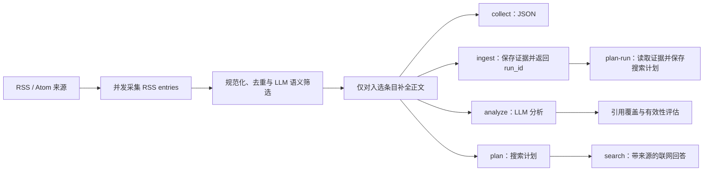

<div align="center">

# Information Agent

从 RSS/Atom 到可追溯结论的证据优先信息工作流

[](https://github.com/Ita-Hloks/InformationAgent/actions/workflows/ci.yml)
[](https://github.com/Ita-Hloks/InformationAgent/stargazers)

</div>

## 这是什么？

Information Agent 是一个 Python CLI：它从一个或多个 RSS/Atom 来源并发采集内容，将每个 RSS entry 保持为独立候选，交给 LLM 按研究主题做语义筛选，再生成结构化 JSON、SQLite 文章快照、LLM 分析、可持久化搜索计划或带来源的联网回答。

项目把确定性边界与语义判断分开：采集、格式清洗、去重、候选 ID 校验、数量上限、重试和状态由普通代码完成；LLM 负责判断条目是否直接相关、是否仍是单一文章。没有证据时，工作流不会生成事实结论；单个来源或语义筛选失败时，已取得的快照和错误上下文仍会保留，但未经判定的文章不会放行。

## 快速开始

需要 Python 3.11 或更高版本。

```bash
git clone https://github.com/Ita-Hloks/InformationAgent.git
cd InformationAgent
python -m venv .venv
```

激活虚拟环境：

```powershell
# Windows PowerShell
.venv\Scripts\Activate.ps1
```

```bash
# macOS / Linux
source .venv/bin/activate
```

安装依赖并配置 `LLM_API_KEY` 后运行采集流程：

```bash
python -m pip install -r requirements.txt
python -m information_agent.cli collect "Python" "https://github.com/python/cpython/commits/main.atom" --limit 5
```

命令默认将 UTF-8 JSON 输出到标准输出。所有子命令都可使用 `--output PATH`，让 Python 直接将结果写入 UTF-8 文件并覆盖同名文件；目标文件的父目录必须已经存在。可同时传入多个 RSS/Atom 地址；`--timeout` 控制整条工作流的总时限，`--limit` 控制输出或送入后续阶段的文章数。

Windows PowerShell 5.1 处理原生进程管道时可能错误解码 UTF-8，建议直接写入文件后读取：

```powershell
python -m information_agent.cli ingest `
  "人工智能" `
  "https://" `
  --limit 5 `
  --output ingest-result.json

$result = Get-Content ingest-result.json -Raw -Encoding UTF8 | ConvertFrom-Json
$result.run_id
```

## 工作流



| 命令 | 用途 | 额外配置 |
| --- | --- | --- |
| `collect` | 采集、规范化、LLM 语义筛选并输出 JSON | `LLM_*` |
| `ingest` | 保存运行记录、全部规范化文章快照、筛选关系与 Feed 缓存 | `LLM_*` |
| `analyze` | 基于已筛选证据生成带证据编号的分析，并评估引用 | `LLM_*` |
| `plan` | 从最多 5 篇候选文章中生成可追溯的搜索计划 | `LLM_*` |
| `plan-run` | 根据 `ingest` 的 `run_id` 读取已选证据，并将规划运行、原始响应、计划与查询写回 SQLite | `LLM_*` |
| `search` | 执行采集、规划和联网回答，保留搜索来源 | `LLM_*` 与 `SEARCH_LLM_*` |
| `verify-search` | 用固定问题检查联网搜索配置、请求和来源返回 | `SEARCH_LLM_*` |

查看全部参数：

```bash
python -m information_agent.cli --help
python -m information_agent.cli collect --help
python -m information_agent.cli plan-run --help
```

保存经过语义筛选的采集结果：

```bash
python -m information_agent.cli ingest \
  "Python" \
  "https://github.com/python/cpython/commits/main.atom" \
  --limit 10
```

数据库默认写入 `data/information_agent.db`，命令输出的 JSON 包含用于追踪本次入库的 `run_id`。如需修改数据库位置，请在当前 Shell 中设置 `INFORMATION_AGENT_DB_PATH`。

要基于这次入库的已选证据生成并保存搜索计划，把输出中的 `run_id` 传给 `plan-run`：

```text
python -m information_agent.cli plan-run RUN_ID --timeout 60
```

命令会返回同一个 `run_id` 和本次规划的 `planning_run_id`。规划结果、查询、原始模型响应以及失败状态都会写回同一 SQLite 数据库。

## 配置 LLM 与联网搜索

复制环境变量示例：

```powershell
# Windows PowerShell
Copy-Item .env.example .env
```

```bash
# macOS / Linux
cp .env.example .env
```

按使用的命令填写以下变量：

| 变量 | 用途 | 默认值 |
| --- | --- | --- |
| `LLM_API_KEY` | `collect`、`ingest`、`analyze`、`plan`、`plan-run` 和 `search` 的模型凭据 | 必填 |
| `LLM_BASE_URL` | OpenAI 兼容 API 根地址 | `https://api.openai.com/v1` |
| `LLM_MODEL` | 语义筛选、分析与规划模型 | `gpt-4o-mini` |
| `SEARCH_LLM_API_KEY` | 联网搜索服务凭据 | 必填 |
| `SEARCH_LLM_MODEL` | 支持项目所需 `web_search` 工具的模型 | 必填 |
| `SEARCH_LLM_BASE_URL` | 联网搜索服务的 OpenAI 兼容 API 根地址 | 必填 |
| `SEARCH_LLM_RESULT_COUNT` | 每次搜索返回的结果数量，范围 1–50 | `5` |
| `SEARCH_LLM_CONTENT_SIZE` | 搜索内容大小：`low`、`medium` 或 `high` | `medium` |
| `SEARCH_LLM_TIMEOUT_SECONDS` | 单次联网回答的最长时限 | `60` |

配置完成后，可先验证搜索服务：

```bash
python -m information_agent.cli verify-search
```

再运行分析、规划或完整搜索：

```bash
python -m information_agent.cli analyze "Python" "https://github.com/python/cpython/commits/main.atom"
python -m information_agent.cli plan "Python" "https://github.com/python/cpython/commits/main.atom"
python -m information_agent.cli search "Python" "https://github.com/python/cpython/commits/main.atom"
```

LLM 与联网搜索调用会备份到 `log/`。可通过 `INFORMATION_AGENT_LOG_DIR` 修改目录；日志可能包含请求与响应内容，请按敏感数据管理。

## 设计要点

- **证据优先**：结论必须引用真实证据编号；材料不足时明确记录不确定性。
- **可追溯输出**：入库与数据库规划分别返回 `run_id` 和 `planning_run_id`；文章元数据、搜索锚点、查询目的、来源和错误均进入结构化结果。
- **确定性边界**：外部服务响应先转换为项目模型；候选 ID、字段类型、原文边界、去重、数量上限和状态由普通代码校验，不把模型生成的 URL 或正文直接当成证据。
- **RSS 条目拆分**：每个 `entry` 都以独立候选送入模型。日报、周报、newsletter 和多篇文章汇编由模型返回原文起止引用，普通代码按原文边界拆成多个片段；无法定位原文边界时不放行该次筛选结果。
- **格式保真**：RSS HTML 清洗保留标题、段落和换行，长文批次优先在段落或句末切分；模型输入使用候选 ID 和明确的文章批次边界，减少摘要格式造成的跨文章混写。
- **失败闭合**：语义筛选响应缺字段、乱造 ID、重复 ID、无法定位原文片段或请求失败时，本次报告为 `partial`，不放行任何未完成判定的文章；规范化快照仍可写入数据库。
- **受控执行**：所有阶段共享同一个总时间预算；RSS 来源默认最多 6 路并发，并对临时网络错误重试。
- **增量入库**：`ingest` 使用 SQLite 保存文章快照，通过 ETag、Last-Modified、条目标识与更新时间标记跳过未变化内容，并在条目更新后重新处理；只有语义筛选入选的摘要条目才会继续请求网页正文。
- **规划持久化**：`plan-run` 从已保存的证据继续规划，并保存原始模型响应、搜索计划、查询及失败信息。
- **部分失败可用**：某个 Feed、模型调用或搜索回答失败时，已获得的证据与错误上下文仍会保留。

## 项目结构

```text
InformationAgent/
├── .agents/
│   └── skills/                 # 仓库内的 Agent 技能
├── .github/
│   └── workflows/             # GitHub Actions
├── information_agent/
│   ├── analysis/              # LLM 分析与引用评估
│   ├── collection/            # RSS/Atom 与网页正文采集
│   ├── common/                # URL、LLM 请求与调用日志
│   ├── investigation/         # 搜索问题与查询规划
│   ├── normalization/         # 文章规范化与内容分批
│   ├── orchestration/         # 时间预算、在线与数据库工作流编排
│   ├── search/                # 托管联网搜索与来源解析
│   ├── selection/             # 主题相关性筛选
│   ├── storage/               # SQLite 快照、运行、Feed 与搜索计划
│   ├── cli.py                 # 命令行入口
│   ├── contracts.py           # 跨阶段公共数据契约
│   └── serialization.py       # JSON 输出
├── tests/                     # 单元、集成与架构约束测试
├── .env.example               # LLM 与搜索配置示例
├── .pre-commit-config.yaml    # 提交前检查
├── pyproject.toml             # pytest 与 Ruff 配置
├── requirements-dev.txt       # 开发依赖
└── requirements.txt           # 运行时依赖
```

## 文档索引

| 资源 | 说明 |
| --- | --- |
| [`.env.example`](.env.example) | LLM 与联网搜索环境变量 |
| [`information_agent/cli.py`](information_agent/cli.py) | CLI 命令、参数与默认值 |
| [`information_agent/orchestration/`](information_agent/orchestration/) | 采集、入库、分析、规划和搜索工作流 |
| [`information_agent/storage/`](information_agent/storage/) | SQLite 文章快照、运行记录、筛选关系、搜索计划与 Feed 状态 |
| [`information_agent/contracts.py`](information_agent/contracts.py) | 公共状态、报告和评估数据契约 |
| [`tests/`](tests/) | 行为、失败路径和架构边界示例 |
| [`.github/workflows/ci.yml`](.github/workflows/ci.yml) | CI 中执行的检查 |

## 开发与贡献

安装开发依赖和提交前钩子：

```bash
python -m pip install -r requirements-dev.txt
pre-commit install
```

提交变更前运行：

```bash
ruff check .
ruff format --check .
python -m pytest
```

建议使用 `<type>[optional scope]: <description>` 格式提交，例如 `docs(readme): clarify search configuration`。README 等文档修改使用 `docs` 类型；完整说明见[约定式提交 1.0.0](https://www.conventionalcommits.org/zh-hans/v1.0.0/)。

<a href="https://github.com/Ita-Hloks/InformationAgent/graphs/contributors">
  
</a>
