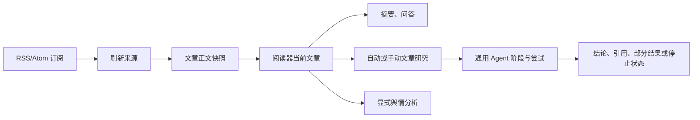

<div align="center">

# Information Agent

面向本地 RSS 阅读器的证据优先信息工作流

[](https://github.com/Ita-Hloks/InformationAgent/actions/workflows/ci.yml)

</div>

## 这是什么？

Information Agent 提供本地 RSS/Atom 阅读器、文章正文快照、摘要、文章问答和文章研究。文章研究从当前文章快照开始，调用通用 Agent 进行阶段化核验，并保存尝试、错误、部分结果和引用。

## 快速开始

需要 Python 3.11 或更高版本：

```bash
git clone https://github.com/Ita-Hloks/InformationAgent.git
cd InformationAgent
python -m venv .venv
python -m pip install -r requirements.txt
```

配置 `LLM_API_KEY` 后，可以运行一次性 CLI：

```bash
python -m information_agent.cli collect "人工智能" "https://www.geekpark.net/rss" --limit 5
```

本地阅读器服务：

```powershell
python -m uvicorn information_agent.api:app --host 127.0.0.1 --port 8001
```

前端开发服务器：

```powershell
cd frontend
npm install
npm run dev
```

数据库默认位置为 `data/information_agent.db`，可使用 `INFORMATION_AGENT_DB_PATH` 指定其他路径。

## 工作流



一次性 CLI 仍提供：

| 命令 | 用途 |
| --- | --- |
| `collect` | 采集、规范化、筛选并输出 JSON |
| `analyze` | 一次性采集并分析 |
| `plan` | 一次性生成搜索计划 |
| `search` | 一次性采集、规划并联网回答 |
| `opinion-run` | 对阅读器文章主动运行舆情分析 |
| `opinion-status` | 读取文章舆情状态 |
| `verify-search` | 验证联网搜索配置 |

## 文章研究 API

| 方法 | 路径 | 用途 |
| --- | --- | --- |
| `GET` | `/api/articles/{article_id}/research` | 获取研究历史元数据 |
| `GET` | `/api/articles/{article_id}/research/{run_id}` | 获取指定运行及 Agent 详情 |
| `POST` | `/api/articles/{article_id}/research` | 创建或复用自动/手动研究 |
| `POST` | `/api/articles/{article_id}/research/{run_id}/stop` | 停止指定研究运行 |

约束：

- 研究必须绑定 `article_id` 和 `snapshot_id`
- 同一文章、同一快照最多一个排队或运行中的任务
- 自动任务不会自动重跑
- 手动任务在上一条结束后可以形成新的历史记录
- 历史列表只返回元数据，详情按需读取
- 当前快照没有结果时不展示其他快照结果

## 舆情分析

舆情分析的后端、API、服务、CLI 和持久化主体保持独立。它只在用户显式调用 `opinion-run` 或 `POST /api/articles/{article_id}/opinion` 时运行；`GET` 接口只读状态。首版只处理直接关联的哔哩哔哩视频或专栏 URL，分析最近 72 小时的公开评论样本，不代表总体民意，也不证明文章主张为真。

## 配置

| 变量 | 用途 |
| --- | --- |
| `LLM_API_KEY` | 主模型凭据 |
| `LLM_BASE_URL` | OpenAI 兼容 API 根地址 |
| `LLM_MODEL` | 主模型名称 |
| `SEARCH_LLM_API_KEY` | 联网搜索模型凭据 |
| `SEARCH_LLM_MODEL` | 联网搜索模型名称 |
| `SEARCH_LLM_BASE_URL` | 联网搜索服务地址 |
| `SEARCH_LLM_ADAPTER` | 搜索协议；官方 OpenAI Responses API 使用 `openai_responses_web_search` |
| `BILIBILI_COOKIE` | 舆情分析所需的可选 Cookie |
| `INFORMATION_AGENT_DB_PATH` | SQLite 数据库路径 |

没有 LLM 配置时仍可使用订阅、刷新和文章阅读接口。

文章研究的可验证来源必须来自搜索服务响应中的真实 `web_search_call`，不能只依赖模型正文自行填写的 URL。使用官方 OpenAI Responses API 时，将 `SEARCH_LLM_ADAPTER` 设为 `openai_responses_web_search`，并将 `SEARCH_LLM_BASE_URL` 设为 `https://api.openai.com/v1`。服务返回 `web_search_call` 和 URL 引用后，研究结果才会被标记为有证据；只有正文 URL 或没有搜索调用时会保留为证据不足。

## 项目结构

```text
InformationAgent/
├── information_agent/
│   ├── collection/            # RSS/Atom 与网页正文采集
│   ├── normalization/         # 文章规范化与快照内容
│   ├── orchestration/         # CLI、文章研究和 Agent 编排
│   ├── opinion/               # 舆情分析业务
│   ├── storage/               # SQLite 快照与生命周期持久化
│   ├── api/                   # FastAPI 阅读器接口
│   ├── cli.py                 # CLI 入口
│   └── serialization.py       # JSON 输出
├── frontend/                  # React 阅读器
├── tests/                     # 定向和回归测试
├── projectFlow.md             # 当前数据流与边界
└── .env.example               # 环境变量示例
```

## 验证

后端定向测试：

```powershell
.\.venv\Scripts\python.exe -m pytest -q
```

前端检查：

```powershell
cd frontend
npm run typecheck
npm run lint
npm run format:check
npm run build
```
