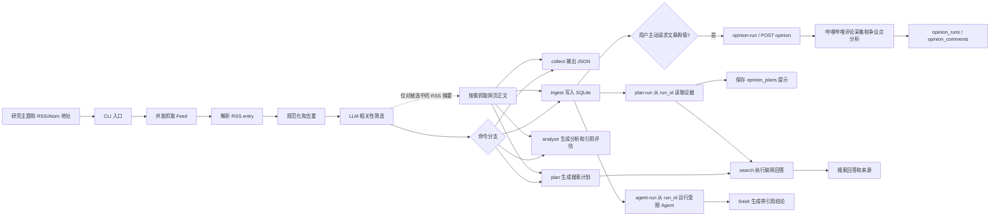
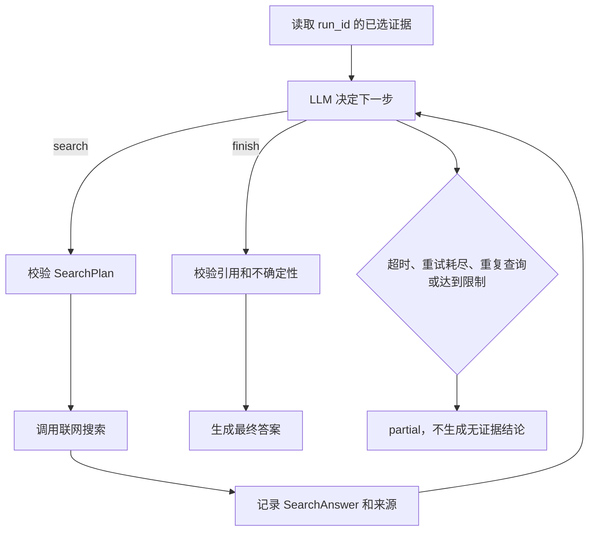

# Information Agent 流程说明

> 本文以当前仓库实现为准，说明从 RSS/Atom 输入到筛选结果、搜索计划、联网回答和前端展示边界的完整数据流。

## 1. 项目定位

Information Agent 是一个 Python CLI 研究流水线。它把外部信息处理成可追踪的证据，再让 LLM 在受控边界内完成语义筛选、分析、问题规划或联网回答。

项目的核心分工是：

- 普通代码负责输入校验、URL 规范化、RSS entry 边界、正文清洗、去重、数量上限、重试、超时、状态和持久化
- LLM 负责语义任务，例如判断文章是否与主题直接相关、生成研究问题、基于证据形成结论
- 未通过校验的模型输出不会直接成为证据、搜索计划或最终结论
- 研究主流程仍是 CLI + SQLite；另有一个本地 FastAPI 阅读 API，供 `frontend/` 访问订阅、文章和阅读状态

## 2. 全局流程



主链可以概括为：

```text
RSS/Atom -> 采集 -> 规范化 -> 相关性筛选 -> 证据编号
                                      |
                 +--------------------+--------------------+
                 |                    |                    |
               analyze              plan                agent-run
                 |                    |                    |
             分析评估             搜索回答             受限搜索循环
```

## 3. CLI 命令和边界

入口文件是 [`information_agent/cli.py`](information_agent/cli.py)。所有命令最终输出 UTF-8 JSON；可用 `--output` 写入文件。

| 命令 | 输入 | 输出 | 是否写入研究数据库 |
| --- | --- | --- | --- |
| `collect` | 主题、一个或多个 RSS/Atom 地址 | 筛选后的文章和错误 | 否 |
| `ingest` | 主题、一个或多个 RSS/Atom 地址 | `run_id`、筛选结果和错误 | 是 |
| `analyze` | 主题、一个或多个 RSS/Atom 地址 | 分析结论、证据和引用评估 | 否，当前只返回 JSON |
| `plan` | 主题、一个或多个 RSS/Atom 地址 | 筛选文章和搜索计划 | 否 |
| `plan-run` | `ingest` 返回的 `run_id` | `planning_run_id`、搜索计划和错误 | 是 |
| `search` | 主题、一个或多个 RSS/Atom 地址 | 文章、计划、联网回答和来源 | 否 |
| `agent-run` | `ingest` 返回的 `run_id` | 搜索观察、最终结论、引用、停止原因和 `analysis_run_id` | 是，写入分析生命周期表 |
| `opinion-run` | 阅读器中的 `article_id` | 哔哩哔哩评论样本、争议点分析和状态 | 是，只有显式调用才运行 |
| `opinion-status` | 阅读器中的 `article_id` | 最近一次舆情运行状态和结果 | 否，只读 |
| `verify-search` | 搜索超时参数 | 固定的联网搜索连通性结果 | 否 |

默认参数的关键点：

- LLM 相关命令默认总时限为 300 秒
- 每个 Feed 的单次请求默认最多 15 秒
- Feed 默认最多 6 路并发，每个来源默认最多尝试 3 次
- `collect`、`ingest` 和 `analyze` 默认上限为 20 篇；`plan`、`plan-run`、`search` 的规划输入最多 5 篇
- `agent-run` 默认最多执行 3 个搜索动作，每个决策或搜索动作最多尝试 3 次

## 4. 采集和筛选流程

### 4.1 Feed 请求

`information_agent/orchestration/collection.py` 负责整个采集阶段。

1. 校验主题、Feed 数量、数量上限、并发数、重试次数和总时限
2. 将每个 Feed 放入异步任务；默认 `collect` 路径共用一个 `aiohttp.ClientSession`，`ingest` 的缓存采集器则在线程中执行带缓存头的同步请求
3. 以最多 6 路并发抓取来源
4. 对超时、网络错误、HTTP 408、429 和 5xx 做有限重试；认证或其他不可恢复的错误不会盲目重试
5. 共享一个单调时钟截止时间，Feed 请求和后续 LLM 筛选共同消耗总预算
6. Feed 响应超过 5 MiB 时拒绝处理

如果部分来源成功、部分来源失败，采集结果保留成功来源并标记为 `partial`。如果所有来源都失败，采集阶段标记为 `failed`。

### 4.2 RSS entry 解析

`information_agent/collection/rss.py` 将每一条 RSS/Atom entry 转成 `RawFeedEntry`，每条 entry 保持为一篇独立候选。采集器会记录：

- 标题、文章 URL、Feed URL 和站点 URL
- RSS 正文或摘要、内容类型、作者、分类和语言
- 发布时间、更新时间、entry ID 和采集时间

如果 entry 有正文，使用正文；否则使用 `summary` 或 `description`。RSS 中的 HTML 标签会被转为纯文本，代码块、脚本、样式等内容不会进入后续 LLM 输入。

### 4.3 规范化

`information_agent/normalization/service.py` 将原始 entry 转成 `NormalizedArticle`：

- 只接受规范化后的 HTTP(S) URL
- 合并多余空白并清理空行
- 正文少于 20 个字符的 entry 被丢弃
- `article_id` 是文章规范化 URL 的 SHA-256 哈希
- 正文默认按最多 2000 字拆分，优先在换行或句末处分段
- 时间统一转为项目时区 `UTC+08:00`
- 同一来源 URL 只保留一个候选

`article_id` 用于跨运行识别文章；LLM 后续看到的 `evidence_id` 则是本次运行内从 1 开始的证据编号，两者不是同一个标识。

### 4.4 LLM 相关性筛选

`information_agent/selection/llm.py` 只让 LLM 判断“这条完整 RSS entry 是否直接与研究主题相关”。它不负责拆分、合并、改写文章，也不负责决定 RSS entry 的边界。

筛选过程如下：

1. 规范化文章按默认每批 10 篇发送给 LLM
2. 每篇输入包含稳定的 `candidate-N` 标识
3. 模型必须返回覆盖全部候选的 JSON `decisions` 数组
4. 普通代码校验字段、候选 ID 集合和布尔类型
5. 通过校验的 `selected: true` 候选按 `limit` 截断，并重新编号为 `evidence_id`
6. JSON 结构错误、候选缺失、乱造 ID 或重复 ID 会使语义筛选失败，不会放行未经确认的文章

发送给筛选模型的单篇正文最多 12,000 字；过长正文保留首尾并省略中间内容。原始规范化快照仍可继续保存，模型输入清洗不等于删除原始数据。

### 4.5 按需补全网页正文

RSS 只提供摘要时，项目不会先抓取所有文章正文，而是在相关性筛选之后只对被选中的摘要候选调用 `augment_evidence`：

- 使用 `trafilatura` 从网页中提取正文
- 单页最大 2 MiB
- 同一域名默认不超过每秒 3 次请求
- 网页请求或正文提取失败时保留原 RSS 摘要，不让一次网页失败覆盖已有证据
- 补全后的文章重新规范化，再进入 JSON 输出或 SQLite 入库

## 5. `ingest` 和 SQLite 持久化

### 5.1 运行生命周期

`information_agent/orchestration/ingestion.py` 使用 `SQLiteCollectionStore`：

1. 创建 `research_runs` 记录，状态为 `collecting`
2. 读取 Feed 的 ETag 和 Last-Modified
3. 对 HTTP 304 或数据库中未变化的 entry 跳过重复处理
4. 执行与 `collect` 相同的采集、规范化、筛选和正文补全
5. 保存所有规范化文章快照，并标记本次运行中哪些快照被选为证据
6. 保存 Feed 缓存状态和 entry 观察记录
7. 用 `completed`、`partial` 或 `failed` 结束 `research_runs`

默认数据库路径是 `data/information_agent.db`，可用 `INFORMATION_AGENT_DB_PATH` 覆盖。

### 5.2 主要数据表

| 表 | 作用 |
| --- | --- |
| `research_runs` | 保存主题、Feed 列表、运行状态和错误 |
| `articles` | 以规范化来源 URL 标识文章 |
| `article_snapshots` | 按正文哈希保存不同版本的规范化文章 |
| `run_evidence` | 连接运行和文章快照，保存 `selected` 与 `evidence_no` |
| `feeds` | 保存 ETag、Last-Modified 和上次成功观察时间 |
| `feed_entries` | 记录 entry key、更新时间标记和文章映射，用于增量处理 |
| `planning_runs` | 保存基于 `run_id` 的规划运行及原始响应 |
| `search_plans` | 保存问题、原文锚点、问题类型和优先级 |
| `search_queries` | 保存每个计划的查询及查询目的 |
| `opinion_plans` | 保存 Planner 判断为值得查看公开讨论的文章提示，平台固定为哔哩哔哩、时间窗固定为最近 72 小时 |
| `opinion_queries` | 保存舆情提示预填的哔哩哔哩查询及查询目的 |
| `opinion_runs` | 保存用户主动触发的哔哩哔哩舆情运行状态和结构化结果 |
| `opinion_comments` | 保存该次舆情运行采集到的评论快照，不跨运行混用 |

`run_evidence.selected = 1` 的记录才会被 `plan-run` 和 `agent-run` 读取。普通代码会在入库前校验文章快照和证据编号，LLM 不能凭空扩大证据集合。

### 5.3 `run_id` 的后续使用

`ingest` 返回的 `run_id` 是后续数据库流程的入口：

```text
ingest -> run_id -> plan-run -> planning_run_id / search_plans / opinion_plans
       \-> agent-run -> bounded search -> final_answer / citations
article_id -> opinion-run (显式触发) -> 哔哩哔哩评论 -> opinion_runs / opinion_comments
```

`plan-run` 和 `agent-run` 只接受状态为 `completed` 或 `partial` 的研究运行，并且只读取已经被选中的证据。

## 6. 搜索计划和联网搜索

### 6.1 `plan` 与 `plan-run`

`information_agent/investigation/planner.py` 让 LLM 识别会显著影响后续结论的证据缺口，而不是直接判断文章真假。

每个计划必须满足：

- 引用存在于输入文章正文中的精确 `trigger_quote`
- `evidence_id` 必须来自本次输入的真实证据
- 问题和查询目的必须包含中文
- `priority` 只能是 1
- 每个计划包含 1 到 2 条不重复查询
- 每篇文章最多生成 1 个计划，整次最多生成 3 个计划
- 没有值得外查的缺口时返回 `{"plans": [], "opinion_plans": []}`

Planner 同时判断文章是否存在值得读者即时查看的争议，并可为文章生成 `opinion_plans` 预填提示；`plan-run` 只生成并持久化提示，不抓取评论。用户显式调用 `opinion-run` 或 HTTP `POST /api/articles/{article_id}/opinion` 后，系统才校验直接关联的哔哩哔哩视频/专栏 URL、采集时间窗内评论并调用 LLM 分析争议点；如果文章没有最近的规划提示，显式请求会直接调用争议点识别 LLM。每篇提示最多 1 个，平台固定为哔哩哔哩，时间窗固定为最近 72 小时。当前不做长期监测，也不接入前端操作界面。

舆情分析不判断文章主张真假。结果只描述最近 72 小时内获取到的哔哩哔哩公开评论样本，不代表总体民意或全体观众意见，也不用于证明文章主张为真。LLM 只输出文章争议点、评论样本中的讨论立场、摘要、代表评论编号和不确定性；评论数量和立场分布不能替代事实证据。重复的 `opinion-run` 默认复用最近一次已完成或部分完成的结果，使用 `--refresh` 才重新采集。

舆情报告的数量从样本和关系行核对：`collected_count` 是当前运行保存的评论数，`analyzed_count` 是送入分类阶段的评论数，`classification_total` 是实际建立的争议点-评论关系数，后两个分类数量按 `classification_status` 逐行统计，`points.stance_counts` 只由 `classified` 关系重新聚合。没有分类关系时不保留模型返回的立场数量或代表评论。

状态原因按流程收口：没有争议点为 `completed/no_controversy_points`；评论接口正常但样本为空为 `completed/sample_empty`；有评论或分类结果但分类不完整为 `partial/partial_classification`；没有可用结果的关键失败为 `failed`。遗留 `running` 运行会在后续请求的原子收口中变为 `failed/stale_running`，然后才允许创建新运行。

`plan` 是临时流程，只返回 JSON。`plan-run` 先创建 `planning_runs`，再把规划结果、查询和原始模型响应写回 SQLite；模型输出校验失败时保留错误和原始响应，并把业务报告标记为 `partial`。

### 6.2 `search`

`search` 是不持久化的组合流程：

```text
collect -> plan -> 对每个 SearchPlan 调用 HostedSearchAnswerer -> SearchReport
```

`HostedSearchAnswerer` 使用 `SEARCH_LLM_*` 配置向 OpenAI Chat Completions 兼容接口发送 `web_search` 工具请求。返回结果必须包含非空答案和可解析来源；缺少来源、包含搜索轨迹或明确表示证据不足时，结果为 `insufficient_evidence`，而不是伪造成功。

如果模型只返回了搜索来源却没有合格答案，程序会在剩余时间内最多再做 2 次合成尝试。某个计划回答失败时，已经完成的其他回答和计划仍会保留，整个报告标记为 `partial`。

### 6.3 `verify-search`

`verify-search` 不依赖用户主题，而是执行固定的 Python 官方文档查询，并检查结果中是否存在 `docs.python.org/3` 来源。它用于验证搜索配置、请求、来源解析和答案状态，不代表任意主题的联网搜索都可用。

## 7. `agent-run` 的受限决策循环

`information_agent/orchestration/agent_workflow.py` 从 SQLite 读取已选证据，然后在固定边界内循环：



LLM 只能返回两种决策：

- `search`：提出一个经过相同计划契约校验的搜索动作
- `finish`：提交带 `claim`、`evidence_ids`、`source_urls` 的结论引用

普通代码负责：

- 最大搜索动作数、单步最大尝试次数和总时限
- 可重试错误的判断和重试
- 重复查询检测
- 搜索来源 URL 是否真实出现在当前搜索观察中
- 原始文章编号是否有效
- 搜索回答已采用时，来源 URL 是否绑定到具体结论
- `finish` 是否至少包含一个原始文章或搜索来源引用

所有搜索均返回 `insufficient_evidence` 时，运行状态必须是 `partial`。如果模型错误地用其他结束原因报告，运行时会清空不受支持的答案和引用；只有显式使用 `insufficient_after_search` 时，才保留带证据边界的谨慎说明。

每次 `agent-run` 会创建一个 `analysis_run`，并把决策、搜索和最终收口作为逻辑步骤保存到 `analysis_steps`、`analysis_attempts` 与 `analysis_artifacts`。CLI 和 HTTP 响应都通过 `analysis_run_id` 标识这次持久化分析。

## 8. `analyze` 和引用评估

`analyze` 使用 `WorkflowRunner.run()`，流程是：

1. 执行采集、规范化和相关性筛选
2. 没有证据时直接返回 `partial`，不会调用分析模型
3. 有证据时调用 `LLMAnalyst`
4. 模型只允许返回 `claims` 和 `uncertainties`
5. 每条 claim 必须携带证据编号
6. `evaluate_analysis` 计算引用覆盖率、引用有效性和可检测的文字支持度

这里的评估是结果质量检查，不是外部事实核验：

- 引用覆盖率检查每条结论是否带证据编号
- 引用有效性检查编号是否存在于本次输入证据
- 文字支持度使用标题和正文的词项交集做启发式检查

当前 CLI 的 `analyze` 会返回分析 JSON，但没有把该次分析自动写入 `analysis_runs`、`analysis_steps` 或 `analysis_artifacts`。

## 9. 状态和失败语义

### 9.1 通用运行状态

| 状态 | 含义 |
| --- | --- |
| `completed` | 当前阶段按契约完成，且没有需要上报的错误 |
| `partial` | 已有可用结果，但存在来源、模型、搜索、超时或证据不足问题 |
| `failed` | 当前采集阶段没有成功来源，或整个阶段无法产生可用结果 |

状态不能只看数量。排查一次运行时应同时查看结果中的 `status`、`errors`、证据数量、计划数量和搜索回答状态。

### 9.2 关键边界

- 没有证据时，`analyze` 和 `agent-run` 不会为了填充结果而生成事实结论
- `SearchAnswerStatus.INSUFFICIENT_EVIDENCE` 是正常业务结果，不应被当作 HTTP 500 或程序崩溃
- 某个 Feed 失败不会抹掉其他成功 Feed 的快照
- LLM JSON 校验失败时，不会把部分或格式错误的输出当成合法选择
- `partial` 表示结果不完整，不等于数据库没有写入；`ingest` 仍会保存已获得的快照和错误上下文

## 10. 输出、日志和配置

### JSON 输出

CLI 默认向标准输出写 UTF-8 JSON。使用裸文件名时，文件写入 `log/`，例如：

```powershell
.\.venv\Scripts\python.exe -m information_agent.cli ingest `
  "人工智能" `
  "https://example.com/feed.xml" `
  --limit 5 `
  --output ingest-result.json

$result = Get-Content .\log\ingest-result.json -Raw -Encoding UTF8 | ConvertFrom-Json
$result.run_id
```

传入带目录的相对路径或绝对路径时，CLI 使用用户给出的路径；目标父目录需要预先存在。

### 调用备份日志

LLM 和联网搜索调用会通过 `CallBackup` 写入 JSON：

- 默认目录：`log/`
- 可用 `INFORMATION_AGENT_LOG_DIR` 覆盖
- 记录阶段、请求、响应或错误和完成状态
- 请求与响应可能包含文章内容、提示词或其他敏感数据，不应随意提交到版本库

### 环境变量

| 变量 | 用途 |
| --- | --- |
| `LLM_API_KEY` | 相关性筛选、分析、规划和 Agent 决策 |
| `LLM_BASE_URL` | 主 LLM 的 OpenAI 兼容 API 根地址 |
| `LLM_MODEL` | 主 LLM 模型名 |
| `BILIBILI_COOKIE` | 可选的哔哩哔哩评论接口 Cookie；只从运行环境读取，不读取浏览器配置文件，也不写入 SQLite |
| `SEARCH_LLM_API_KEY` | 联网搜索服务凭据 |
| `SEARCH_LLM_BASE_URL` | 联网搜索服务 API 根地址 |
| `SEARCH_LLM_MODEL` | 支持 `web_search` 的搜索模型 |
| `INFORMATION_AGENT_DB_PATH` | SQLite 数据库路径 |
| `INFORMATION_AGENT_LOG_DIR` | 调用备份目录 |

CLI 会加载 `.env`；前端不应读取这些密钥，也不应直接访问 SQLite。

## 11. SQLite 分析生命周期基础设施

`information_agent/storage/analysis_store.py` 提供分析生命周期持久化混入，SQLite 表结构由
`information_agent/storage/store.py` 初始化：

```text
analysis_runs -> analysis_steps -> analysis_attempts -> analysis_artifacts
```

它支持运行状态、步骤状态、尝试编号、请求哈希、幂等键、artifact 内容哈希，以及中断和取消状态。`tests/test_analysis_storage.py` 覆盖了这些存储契约。

截至当前仓库状态：

- `SQLiteCollectionStore` 已继承这套持久化能力
- `agent-run` 会创建 `analysis_run`，逐次记录决策和搜索的真实重试、错误与最终报告，并返回 `analysis_run_id`
- `POST /api/research/runs/{run_id}/agent` 只提交后台 Agent 任务并立即返回任务快照；快照包含 `run_id`、`analysis_run_id`、`request_id`、状态、阶段、尝试信息和可用报告
- `GET /api/research/runs/{run_id}/agent/status` 按 `run_id` 和可选的 `request_id` 查询任务；任务完成后从 SQLite 恢复持久化状态和报告
- `POST /api/research/runs/{run_id}/agent/stop` 按 `run_id` 和可选的 `request_id` 请求协作式停止；停止期间状态为 `stopping`，最终收口为 `cancelled` 或保留部分结果的 `partial`
- 同一 `request_id` 对同一研究运行具有幂等性，断线重试不会重复创建或执行同一个 Agent 任务
- Agent 管理器启动时会把上次进程遗留的 `created/running` 运行收口为 `partial`；这表示运行被中断并可查询已持久化结果，不表示自动从断点继续执行
- `orchestration/` 的一次性 `analyze` 尚未调用这套分析生命周期接口

因此，受限 Agent 已形成带后台执行、状态查询、停止、幂等和进程重启收口的异步任务服务；这套生命周期仍专用于 Agent，不是通用分析队列。

## 12. 前端当前边界

`frontend/` 是独立的 React 19 + TypeScript + Vite + Tailwind CSS 4 目录。阅读工作区的数据流是：

```text
frontend/src/main.tsx -> App.tsx -> AppRoutes -> ReaderWorkspacePage
    -> frontend/src/api/client.ts -> Vite proxy -> information_agent/api
    -> ReaderService -> SQLite

ResearchWorkspace -> /api/research/runs | /api/research/ingest
                  -> GET|POST /api/research/runs/{run_id}/agent
                  -> orchestration -> SQLite / LLM / hosted search
```

当前已实现订阅阅读闭环和异步研究运行入口：

- `GET/POST /api/feeds` 和 `GET /api/articles` 只覆盖本地 RSS 订阅与文章读取
- `PUT /api/articles/state` 保存当前本地阅读器的已读/收藏状态
- `GET /api/research/runs` 列出历史研究运行，`POST /api/research/ingest` 创建采集运行
- `POST /api/research/runs/{run_id}/agent` 提交后台 Agent，并返回 `run_id`、`request_id`、`analysis_run_id` 和初始状态快照
- `GET /api/research/runs/{run_id}/agent/status` 用于状态轮询和断线后按 `run_id` 恢复任务快照
- `POST /api/research/runs/{run_id}/agent/stop` 请求停止 Agent，并返回停止后的状态或仍在收口中的 `stopping` 快照
- 没有 SSE 或 WebSocket；前端使用状态轮询
- 没有把 HTTP 请求路由到 Python CLI 的长任务生命周期
- 前端不能直接读取 LLM 密钥、调用 SQLite 或替代后端编排
- 后端已提供舆情 `GET/POST` 接口，但前端暂未接入；`GET` 只读，只有显式 `POST` 才触发评论采集和 LLM 分析

CLI 的 `agent-run` 仍是等待完成后输出结果的一次性命令；HTTP 研究入口则使用上述异步任务契约。

## 13. 代码地图

| 目录或文件 | 责任 |
| --- | --- |
| `information_agent/cli.py` | CLI 命令、参数、环境加载和 JSON 输出 |
| `information_agent/collection/` | RSS/Atom 解析和网页正文补全 |
| `information_agent/normalization/` | URL、文本、时间、正文批次和文章 ID 规范化 |
| `information_agent/selection/` | 相关性筛选及模型响应校验 |
| `information_agent/orchestration/collection.py` | 并发、重试、预算、筛选和采集状态 |
| `information_agent/orchestration/ingestion.py` | 增量 Feed 缓存和 SQLite 入库 |
| `information_agent/orchestration/planning.py` | 临时搜索计划流程 |
| `information_agent/orchestration/database_planning.py` | 基于 `run_id` 的持久化规划流程 |
| `information_agent/orchestration/search_workflow.py` | 采集、规划和联网回答组合流程 |
| `information_agent/orchestration/agent_workflow.py` | 有界 Agent 决策、搜索、结束和引用校验 |
| `information_agent/analysis/` | LLM 分析和引用质量评估 |
| `information_agent/investigation/` | 搜索问题、计划契约和解析 |
| `information_agent/opinion/` | 哔哩哔哩目标解析、评论采集、争议点和评论分析 |
| `information_agent/search/` | 联网搜索客户端、来源解析和连通性验证 |
| `information_agent/storage/` | 研究运行、文章快照、Feed 缓存、规划和分析生命周期存储 |
| `information_agent/contracts.py` | 跨阶段状态和报告数据契约 |
| `information_agent/serialization.py` | Python 数据模型到 JSON 的转换 |
| `tests/` | 采集、筛选、规划、搜索、Agent、持久化和失败路径测试 |

## 14. 常用运行方式

### 仅查看筛选结果

```powershell
.\.venv\Scripts\python.exe -m information_agent.cli collect `
  "人工智能" `
  "https://example.com/feed.xml" `
  --limit 5
```

### 入库并继续规划

```powershell
.\.venv\Scripts\python.exe -m information_agent.cli ingest `
  "人工智能" `
  "https://example.com/feed.xml" `
  --limit 5 `
  --output ingest-result.json

.\.venv\Scripts\python.exe -m information_agent.cli plan-run RUN_ID
```

### 从入库证据运行受限 Agent

```powershell
.\.venv\Scripts\python.exe -m information_agent.cli agent-run RUN_ID
```

### 运行一次性分析或组合搜索

```powershell
.\.venv\Scripts\python.exe -m information_agent.cli analyze `
  "人工智能" `
  "https://example.com/feed.xml"

.\.venv\Scripts\python.exe -m information_agent.cli search `
  "人工智能" `
  "https://example.com/feed.xml"
```

### 主动获取文章舆情

```powershell
.\.venv\Scripts\python.exe -m information_agent.cli opinion-status ARTICLE_ID
.\.venv\Scripts\python.exe -m information_agent.cli opinion-run ARTICLE_ID --limit 100
```

首版只接受文章本身是哔哩哔哩视频或专栏 URL。`opinion-status` 不会触发采集；`opinion-run` 才会在最近 72 小时内获取最多 200 条评论并分析争议点。输出仅是限定时间窗的公开评论样本观察，不代表总体民意、全体观众意见或事实核验结果。

## 15. 追踪一次运行时的检查顺序

当结果数量异常、状态为 `partial` 或输出为空时，按以下顺序排查：

1. 先看 CLI JSON 的 `status`、`errors` 和证据数量
2. 检查 Feed 是否成功、是否返回 304、是否因增量缓存没有新 entry
3. 检查规范化阶段是否因 URL 无效或正文少于 20 个字符丢弃 entry
4. 检查 `relevance-selection` 调用备份中的请求、响应和状态
5. 对 `ingest` 检查 `research_runs`、`article_snapshots` 和 `run_evidence`
6. 对 `plan-run` 检查 `planning_runs`、`search_plans`、`search_queries`、`opinion_plans` 和 `opinion_queries`
7. 对 `agent-run` 检查 `answers`、`citations`、`stop_reason` 和搜索调用备份
8. 对 `opinion-status` / `opinion-run` 检查 `opinion_runs`、`opinion_comments`、评论采集错误和分析不确定性
9. 最后区分“没有待处理工作”“确定性过滤”“模型未选中”“证据不足”和“真正失败”

这套检查顺序能保持数据从来源、快照、证据编号到最终结论的可追溯关系，避免把空结果直接解释成采集失败或模型拒绝。
