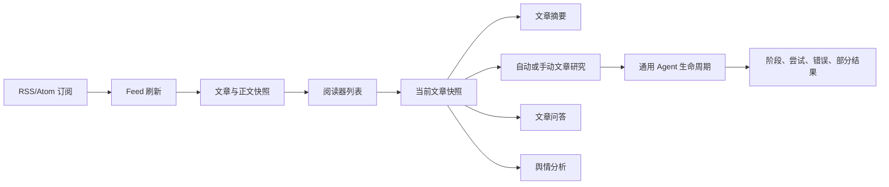

# Information Agent 流程说明

本文记录当前实现中的阅读器、文章研究、通用 Agent 和舆情边界。主题级“任意 RSS/Atom -> 采集入库 -> 证据集 -> Agent”业务已经废除；不会保留旧 API、旧 CLI 或兼容别名。

## 1. 当前产品边界

系统有两条保留路径：

- 阅读器路径：订阅 RSS/Atom、刷新来源、保存文章正文快照、维护阅读状态
- 文章研究路径：从阅读器当前文章快照创建自动或手动研究任务，并在该快照上运行通用 Agent

舆情分析是独立保留业务。其后端、API、服务、CLI 和持久化主体不因阅读器研究迁移而改变；文章研究只复用通用 Agent 生命周期和底层运行关系。

一次性 CLI 的 `collect`、`analyze`、`plan`、`search` 和搜索验证仍按各自现有契约执行，但它们不是阅读器研究历史的入口，也不会为前端提供主题级运行列表。

## 2. 阅读器数据流



Feed 刷新只负责把订阅内容变成文章快照。旧的主题采集入库链不再作为独立业务存在。文章研究必须使用阅读器已经存在的 `article_id` 和 `snapshot_id`，不能接收任意主题和任意 Feed 地址作为入口。

## 3. 文章快照契约

- 每次正文变化产生新的 `article_snapshots` 记录，并由 `snapshot_id` 和 `content_hash` 标识
- 文章研究、摘要和问答均绑定正文快照
- 研究历史列表只返回元数据，不内嵌 Agent 报告
- 读取某一条历史记录时，详情接口再次校验文章、运行和快照的归属
- 当前快照没有研究结果时，阅读器不展示其他快照的报告
- 选择历史记录后，才按 `run_id` 加载该历史快照对应的 Agent 详情

## 4. 文章研究生命周期

文章研究记录存储在 `article_research_runs`，状态为：

```text
queued -> running -> completed
                  -> partial
                  -> failed
                  -> cancelled
```

创建约束：

- 同一文章、同一正文快照最多存在一个 `queued` 或 `running` 任务
- 自动模式在同一文章快照上不自动重跑；已有自动记录会被复用
- 手动模式在已有记录结束后可以再次创建新的手动记录
- 手动请求撞上活动任务时复用活动任务，不并发创建第二条记录
- `request_id` 只用于显式请求重放；同一个标识不能指向不同文章、快照、模式或配置

任务由 `ArticleResearchTaskManager` 串行调度，手动队列优先于自动队列。服务重启时，未收口的运行状态被标记为 `partial`，并记录重启错误；排队任务会重新进入队列。

## 5. 停止与部分结果

- 排队任务可以直接从队列移除并写为 `cancelled`
- 运行中任务向通用 Agent 设置协作式停止信号
- Agent 停止前已经写入的阶段、尝试、错误、artifact 和部分报告保留在分析生命周期表中
- 停止等待超时不会提前释放文章快照的活动任务约束；后台 worker 收口后才清除停止标记
- worker 的终态更新带有期望状态，停止请求不会被迟到的 worker 写回覆盖

## 6. HTTP API

阅读器相关接口位于 `information_agent/api/app.py`。核心文章研究接口如下：

| 方法 | 路径 | 作用 |
| --- | --- | --- |
| `GET` | `/api/articles/{article_id}/research` | 获取文章研究历史元数据 |
| `GET` | `/api/articles/{article_id}/research/{run_id}` | 获取指定研究运行及 Agent 详情 |
| `POST` | `/api/articles/{article_id}/research` | 创建或复用自动/手动研究任务 |
| `POST` | `/api/articles/{article_id}/research/{run_id}/stop` | 停止指定文章研究任务 |
| `GET` | `/api/articles/{article_id}/opinion` | 读取舆情状态 |
| `POST` | `/api/articles/{article_id}/opinion` | 显式触发舆情分析 |

已废除的 `/api/research/*` 主题级入口统一不再注册，访问结果为 `404`。前端只通过文章研究接口工作，不再加载独立研究页面或全局研究运行列表。

## 7. CLI 边界

当前 CLI 命令由 `information_agent/cli.py` 注册：

| 命令 | 作用 |
| --- | --- |
| `collect` | 采集并输出筛选结果，不写入主题研究运行列表 |
| `analyze` | 一次性采集并分析 |
| `plan` | 一次性生成搜索计划 |
| `search` | 一次性采集、规划并联网回答 |
| `opinion-run` | 对阅读器文章显式运行舆情分析 |
| `opinion-status` | 读取文章舆情状态 |
| `verify-search` | 验证联网搜索配置 |

`ingest`、`plan-run`、`list-runs` 和 `agent-run` 已删除，不保留兼容命令。通用 Agent 的持久化执行由文章研究后台任务调用；CLI 不再以主题运行 ID 作为前端研究入口。

## 8. 持久化关系

文章研究使用以下关系保存可追溯生命周期：

```text
article_snapshots
        |
article_research_runs -- research_runs -- run_evidence
        |
analysis_runs
        |
analysis_steps -- analysis_attempts
        |
analysis_artifacts
```

`opinion_runs` 及其评论、分类和尝试关系属于舆情业务，保持独立。清理废弃主题数据时，只删除未被 `article_research_runs` 关联的旧 `research_runs` 及其派生规划、分析和证据记录，不删除文章研究运行、文章快照、订阅或 `opinion_runs`。

## 9. 前端数据流

```text
AppRoutes -> ReaderWorkspacePage
          -> api/client.ts
          -> FastAPI article endpoints
          -> ReaderService / SQLiteCollectionStore
```

阅读器切换文章时以 `article_id:snapshot_id` 重置研究状态。历史列表先展示元数据，选中记录后再读取详情；轮询只针对当前选中的活动运行。研究按钮在当前快照存在活动任务时不会创建并发任务，停止按钮只作用于当前选中的运行。

## 10. 代码地图

| 路径 | 责任 |
| --- | --- |
| `information_agent/reader/` | 订阅、刷新、文章和快照服务 |
| `information_agent/storage/reader_automation.py` | 摘要设置、文章研究记录和快照归属校验 |
| `information_agent/orchestration/article_research_tasks.py` | 文章研究排队、停止、恢复和 worker 收口 |
| `information_agent/orchestration/agent_tasks.py` | 通用 Agent 后台任务和可恢复快照 |
| `information_agent/orchestration/agent_workflow.py` | Agent 阶段、重试、搜索、部分结果和停止 |
| `information_agent/storage/analysis_store.py` | 分析运行、步骤、尝试和 artifact 持久化 |
| `information_agent/opinion/` | 舆情分析业务，保持独立 |
| `frontend/src/components/readerWorkspace/` | 文章列表、正文和文章研究历史 |

## 11. 验证重点

修改文章研究时，至少验证：

1. 同一文章快照的自动/手动活动任务唯一性
2. 自动任务重复请求不创建新记录
3. 已结束后手动请求可以创建历史记录
4. 历史列表不包含 Agent 详情，详情按文章归属校验
5. 排队和运行中停止都能收口，Agent 部分结果仍可读取
6. 旧 `/api/research/*` 路由返回 `404`
7. 舆情接口行为没有变化
